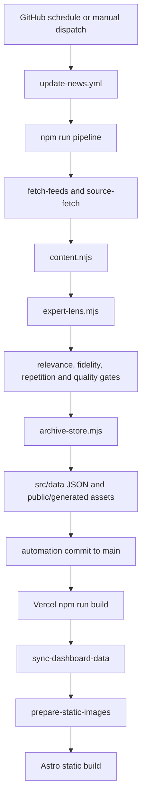

# GPT-5.6 runtime map

## Production content path



The scheduled job does not call the newer autonomous editorial desk as its canonical
writer. Multiple manual commands can write the same archives and make provenance
ambiguous.

## Public request path

Astro page routes load checked-in JSON through presentation and eligibility helpers.
The homepage, archive, article, category, company, region, RSS, and both sitemap systems
derive overlapping but non-identical read models. Vercel serves the static output and
three serverless admin APIs.

The production homepage has a small transfer/runtime footprint but a large static route
and asset footprint. Generated images use revalidation caching; immutable Astro assets
use a one-year cache.

## Admin mutation path

```text
browser -> /api/admin/login -> signed cookie
browser -> /api/admin/article + CSRF -> GitHub Contents API
GitHub commit to main -> Vercel deployment -> public JSON read model
```

This path is fail-closed without credentials but is not a durable CMS. The authenticated
dashboard API reads checked-in admin models; required list/create/source/quarantine/
pipeline/audit routes are absent.

## Image path

```text
feed image or requested AI generation
  -> image provider registry
  -> configured provider attempt
  -> silent source/local fallback
  -> public/generated WebP
  -> prepare-static-images canonicalization during build
  -> public presentation provenance inference
```

The workflow/provider environment mismatch means `ChatGPT Image2 visual` is not proof
that Image2 generated the asset. Provider success, fallback type, prompt version, source
URL, hash, and generation timestamp need explicit immutable metadata.

## Failure behavior

- Extraction QA fails closed for long form, but broad homepage routing can still expose
  weak source signals.
- Failed editorial generation can be deleted or blocked rather than consistently
  downgraded to a clean Source Signal.
- Network fetches follow redirects and buffer full bodies without destination or byte
  controls.
- Automation commits and Vercel deployments are coupled to timestamp-only changes.
- Tests depend on a prior build and the build mutates tracked source artifacts.

## Target runtime

The target path is `connector -> safe fetch -> extraction -> state machine -> relevance
-> clustering -> route -> multi-pass editorial -> review -> transactional publish ->
public read model`. Every implementation is obtained from a central plugin registry.
Only `content:cycle` may execute the full production lifecycle; phase commands call the
same orchestrator with bounded start/end states.
