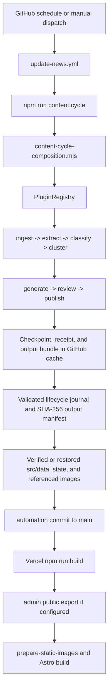

# GPT-5.6 runtime map

## Production content path



The scheduled job and `npm run pipeline` compatibility command resolve the same canonical
composition. Each named phase uses the same registry and file checkpoint, so a failed run
restarts at the failed phase rather than replaying completed providers. The workflow serializes
writers and preserves failed checkpoints across ephemeral runners. Completed checkpoints must
match a durable publication receipt and byte-level output bundle before another run starts. A
mismatched pipeline version or lifecycle journal fails closed.

## Public request path

Astro page routes load checked-in JSON through presentation and eligibility helpers.
The homepage, archive, article, category, company, region, RSS, and both sitemap systems
derive overlapping but non-identical read models. Vercel serves the static output and
three serverless admin APIs.

The production homepage has a small transfer/runtime footprint but a large static route
and asset footprint. Generated images use revalidation caching; immutable Astro assets
use a one-year cache.

## Admin mutation path

```text
browser -> /api/admin/login -> Argon2id + durable session hooks -> signed cookie
browser -> /api/admin/articles or article + CSRF/RBAC -> AdminCmsService
AdminCmsService -> Postgres in production / isolated local adapter in tests
publish mutation -> transactional revision, audit, and publication outbox
build -> configured admin public export -> Astro public read model
```

Production storage is fail-closed without database and Blob credentials. The route and service
surface includes article list/create/edit, revisions, media, audit, source/pipeline operations,
quarantine, soft deletion, and permanent-delete confirmation. Managed preview persistence remains
unverified until the external preview credentials and migrations are available.

## Image path

```text
feed image or requested AI generation
  -> image provider registry
  -> configured provider attempt
  -> silent source/local fallback
  -> public/generated WebP
  -> prepare-static-images canonicalization during build
  -> public presentation provenance inference
```

The workflow/provider environment mismatch means `ChatGPT Image2 visual` is not proof
that Image2 generated the asset. Provider success, fallback type, prompt version, source
URL, hash, and generation timestamp need explicit immutable metadata.

## Failure behavior

- Source extraction uses the canonical public and long-form fail-closed gates.
- Clean, relevant sources without enough long-form evidence become Source Signals.
- Editorial service, image, generation, fidelity, claim, SEO, or repetition failures cannot
  publish local long form; the record is downgraded to a Source Signal.
- A provider failure records the phase and retry classification in the checkpoint. A rerun
  resumes that phase with the same run ID and does not replay completed phases.
- Only the publish provider mutates the public JSON read model. It persists a preparing receipt
  before side effects, captures a content-addressed output bundle, and persists a completed result
  afterward. Completed run IDs restore missing or changed state, image, archive, and JSON files
  from the bundle without rerunning public side effects.
- Dashboard/state-only commits are ignored by the Vercel build rule after integration.
